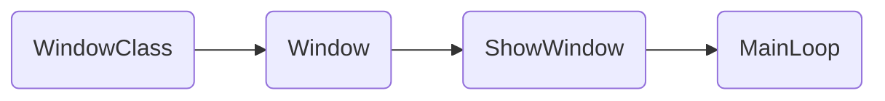
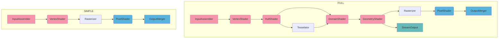
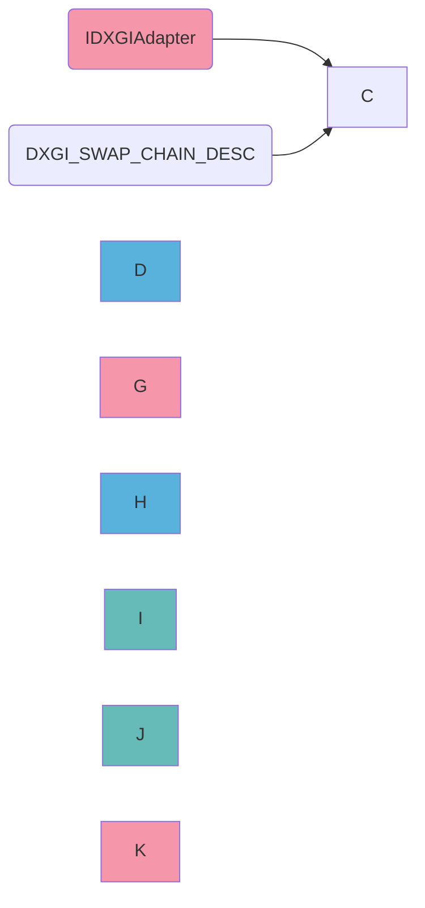

# Preface

# 1. Win32 框架

一般的主循环和消息机制挂钩，每次进入循环时先处理Windows系统消息，再做引擎相关的更新。而对Windows系统消息的利用要尽可能低，仅处理少量必要的窗口消息（菜单，新建/关闭窗口），其它需要处理的消息如用户键盘输入则交给上层引擎做。如非必要，尽量将Windows那一套东西仅用于提供引擎输出画面的窗口。

# 2. DirectX 11 绘制

## 上下文信息

- **IDXGISwapChain**：颜色缓存，和创建的**HWND**对象绑定来显示。
- **ID3D11Device**：提供显示设备相关的接口，用于创建各种资源。线程安全，可以多个线程同时访问。
- **ID3D11DeviceContext**：设备上下文，维护流水线状态。非线程安全，多线程访问需要进行线程同步。

## DirectX 11 流水线

色表示可读取Memory

色表示可写入Memory

色表示可读写Memory

## InputAssembler Stage

- **ID3D11Buffer**(VertexBuffer,VB)：存储顶点数据，作为VertexShader(VS)的输入。
- **ID3D11Buffer**(IndexBuffer,IB)：存储顶点索引数据，描述顶点绘制顺序。
- **D3D_PRIMITIVE_TOPOLOGY**：描述如何从IB中的顶点索引组成图元（三角形，三角形扇等）。
- **ID3D11InputLayout**：存储顶点格式，VS根据该格式解析VB的数据。
> 由于InputLayout里定义的语义等信息直接对应VS的输入，因而创建时要提供VS的字节码。

## Rasterizer Stage

- **ID3D11RasterizerState**：投影空间转到NDC，背面剔除，裁剪，光栅化，MSAA，视口绑定。

## OutputMerger Stage

- **ID3D11RenderTargetView**(RTV): 颜色缓存，最多8个，可以绑定任意**ID3D11Resource**对象，如果该对象是则同时用于显示。
- **ID3D11DepthStencilView**(DSV)：深度模板缓存，用于深度测试和模板测试。
- **ID3D11DepthStencilState**:深度模板测试参数，包括是否开启模板测试，是否开启深度测试，深度缓存写掩码，模板缓存读写掩码，正面背面相应的深度操作。
- **ID3D11BlendState**:每个RTV独立的混合参数，包括混合系数，混合操作。

## XXXShader Stage

- **ID3D11Buffer**(ConstBuffer,CB)：存储非格式化常量数据。
- **ID3D11ShaderResourceView**(SRV)：存储格式化的常量数据。
- **ID3D11SamplerState**：采样器，描述如何读SRV中的数据。
- **ID3D11XXXShader**：着色器。

# 3. DirectX 11 初始化

## 初始化

初始化流程如下

A(SwapChain)-->B(BackBuffer)
B-->C(RenderTargetView)
C-->D(RenderTarget)
E(DepthBuffer)-->F(DepthStencilView)
F-->D
D-->G(Context)
H(DepthStencilState)-->G
I(RasterizerState)-->G
J(Viewport)-->G
K(Device)-->B
K-->C
K-->E
K-->F
K-->H
K-->I

色表示最先创建的内容，之后所有设备相关资源都需要通过Device来创建

色表示绘制管线上RasterizerStage所需内容

色表示绘制管线上OutputMergerStage所需内容

## DEMO中只运行一次的内容

* 初始化D3D，包括Rasterizer和OM
* 创建VB，IB，纹理
* 编译并创建Shader，创建InputLayout
* 创建Shader相关资源（ConstBuffer，SamplerState...）

## DEMO中每帧运行的内容

* 清理颜色缓存，深度缓存，模板缓存
* IA设置VB，IB，PrimitiveTopology，InputLayout
* VS设置相关资源
* PS设置相关资源
* DrawCall
