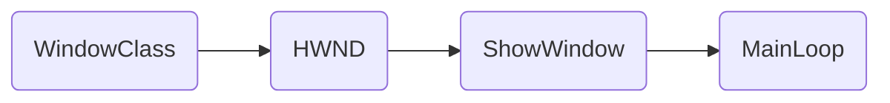
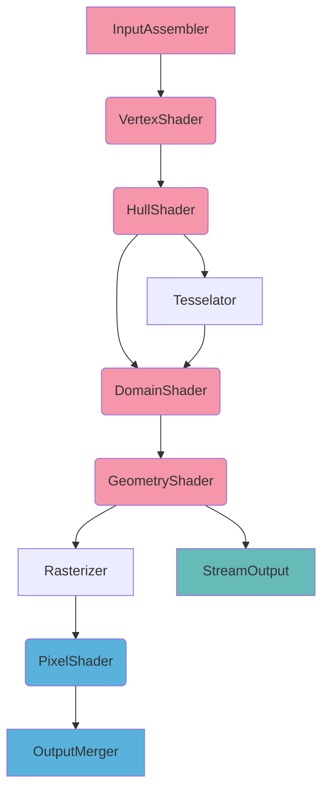
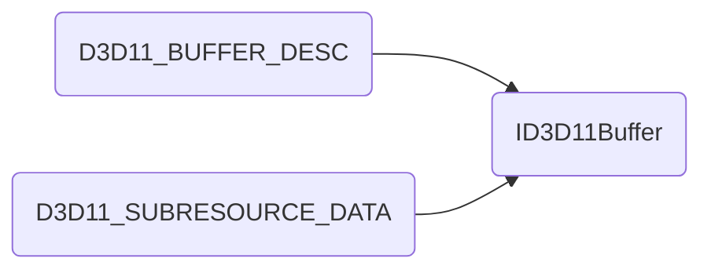
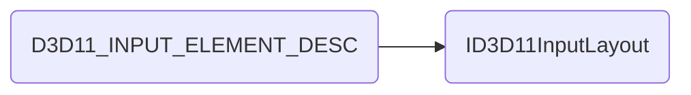
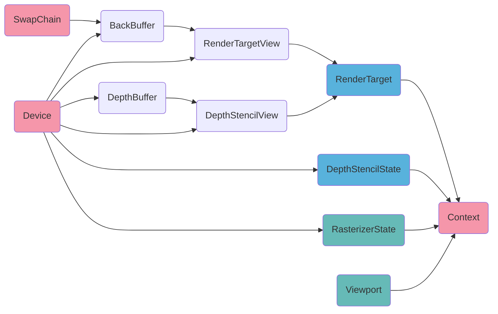

# Preface

# 1. Win32 框架

一般的主循环和消息机制挂钩，每次进入循环时先处理Windows系统消息，再做引擎相关的更新。而对Windows系统消息的利用要尽可能低，仅处理少量必要的窗口消息（菜单，新建/关闭窗口），其它需要处理的消息如用户键盘输入则交给上层引擎做。如非必要，尽量将Windows那一套东西仅用于提供引擎输出画面的窗口。

# 2. DirectX 11 渲染

## 上下文信息

- IDXGISwapChain：颜色缓存，和Windows的HWND绑定来决定显示在哪个窗口，并有前后缓存机制
- ID3D11Device：提供显示设备（GPU）相关的接口，用于创建各种资源。线程安全，可以多个线程同时访问。
- ID3D11DeviceContext：设备上下文，维护流水线状态。非线程安全，多线程访问需要进行线程同步。

## DirectX 11 流水线

色表示可读取Memory

色表示可写入Memory

色表示可读写Memory

## InputAssembler Stage

### VertexBuffer

存储顶点数据，作为VertexShader的输入。

### IndexBuffer

存储顶点索引数据，用于确定每一图元包含的顶点。

### PrimitiveTopology

描述如何从IndexBuffer中的定点索引组成图元，如*D3D11_PRIMITIVE_TOPOLOGY_TRIANGLELIST*表示IndexBuffer中，每三个索引项对应的顶点组成一个三角形图元。

### InputLayout

存储顶点格式，用于确定如何解析VertexBuffer的每一项顶点数据。

由于InputLayout里定义的语义等信息直接对应VertexShader的输入，因而创建时要提供VertexShader的字节码。

## Rasterizer Stage

投影空间转到NDC，背面剔除，裁剪，光栅化，MSAA，视口绑定

## OutputMerger Stage

### RenderTarget

- RenderTargetView: 流水线输出，可以绑定到任意纹理上，如果纹理是BackBuffer，则同时用于显示
- DepthStencilView：深度与模板缓存，用于深度测试和模板测试

### DepthStencil State

是否开启模板测试，是否开启深度测试，深度缓存写掩码，模板缓存读写掩码，正面背面相应的深度操作

### Blend State

对每个RenderTargetView定义混合参数，混合操作

## 初始化

初始化流程如下

色表示最先创建的内容，之后所有设备相关资源都需要通过Device来创建

色表示绘制管线上RasterizerStage所需内容

色表示绘制管线上OutputMergerStage所需内容

## DEMO中只运行一次的内容

* 初始化D3D，包括Rasterizer和OM
* 创建VB，IB，纹理
* 编译并创建Shader，创建InputLayout
* 创建Shader相关资源（ConstBuffer，SamplerState...）

## DEMO中每帧运行的内容

* 清理颜色缓存，深度缓存，模板缓存
* IA设置VB，IB，PrimitiveTopology，InputLayout
* VS设置相关资源
* PS设置相关资源
* DrawCall
