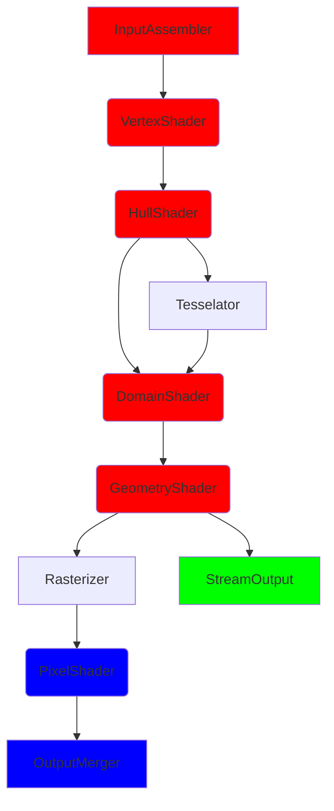

## DirectX11的绘制流水线

<!-- TODO color -->

```mermaid
graph TD
A[InputAssembler]-->B(VertexShader)
B-->C(HullShader)
C-->D[Tesselator]
C-->E(DomainShader)
D-->E
E-->F(GeometryShader)
F-->G[Rasterizer]
F-->H[StreamOutput]
G-->I(PixelShader)
I-->J[OutputMerger]
style A fill:#F00;
style B fill:#F00;
style C fill:#F00;
style E fill:#F00;
style F fill:#F00;
style H fill:#0F0;
style I fill:#00F;
style J fill:#00F;
```
