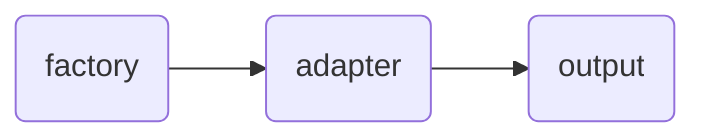
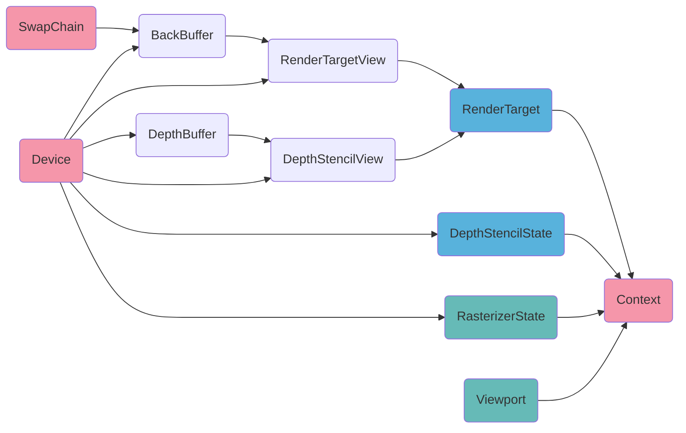
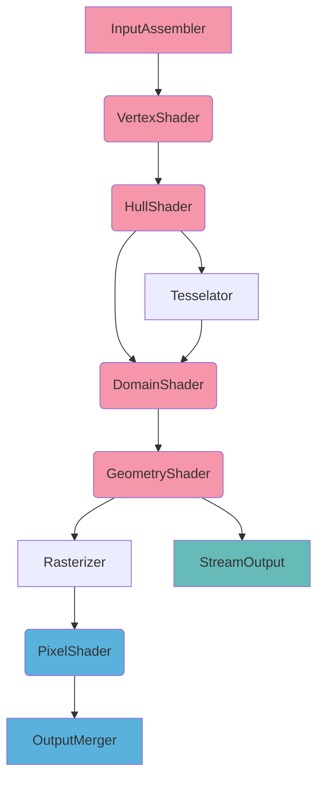
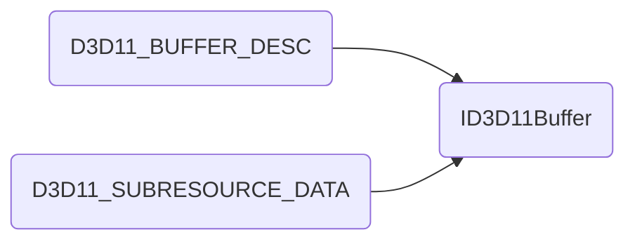
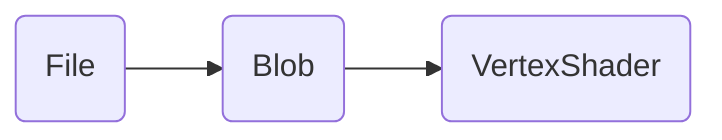

## COM组件

所有DX11的组件都是COM组件，所有COM组件一旦获得都需要手工释放

### 获取设备信息



首先需要创建DXGI的工厂，该工厂可以枚举显示设备信息，从某一显示设备上可以获取显示输出信息

从输出信息里可以得到显示模式列表，主要从显示模式里获取刷新率，是否垂直同步的信息

## 初始化

初始化流程如下



色表示最先创建的内容，之后所有设备相关资源都需要通过Device来创建

色表示绘制管线上RasterizerStage所需内容

色表示绘制管线上OutputMergerStage所需内容

## DirectX11的绘制流水线



色表示可读取Memory

色表示可写入Memory

色表示可读写Memory

Rasterizer和OM在初始化D3D时设置，尽管可以实时修改状态，一般初始化后不修改

IA，VS，PS是主要的几个需要实时修改的流水级，且不需要手动设置状态

### InputAssembler

#### 顶点结构体

Host级别的顶点结构体，可以包括顶点坐标，顶点法向，顶点uv等信息。描述一个顶点的信息

#### VertexBuffer

Host上的顶点信息需要通过VertexBuffer传递到Device。一个VertexBuffer本质上是一块缓冲区，创建一个缓冲区需要两部分，缓冲区的描述信息以及相应的Host端数据：



一旦VertexBuffer创建完成，Host端的数据就没有用了，如果是动态分配的话记得释放这部分内存

#### IndexBuffer

知道了顶点顺序后还需要知道顶点的绘制顺序，IndexBuffer规定了这个顺序，其用一个整数记录VertexBuffer中的顶点下标，然后按照下标顺序绘制顶点。IndexBuffer的本质也是缓冲区，因此创建方式与Host端数据处理方式和VertexBuffer相同

#### PrimitiveTopology

IndexBuffer只描述了顶点的绘制顺序，但没有指定顶点的组织方式。PrimitiveTopology指定了以何种方式组织IndexBuffer中的顶点，一般使用*D3D11_PRIMITIVE_TOPOLOGY_TRIANGLELIST*选项，表示IndexBuffer中，每三个顶点组成一个独立的三角形作为基本绘制单元。

#### InputLayout

顶点结构体只定义了Host端的顶点信息，但是这些信息在Device端看来是裸数据，要顺利读出数据还需要指定顶点的布局信息InputLayout。顶点结构体中每一个成员都要用一个*D3D11_INPUT_ELEMENT_DESC*描述，包括语义，数据格式等：

```c++
typedef struct D3D11_INPUT_ELEMENT_DESC
{
    LPCSTR SemanticName;//语义
    UINT SemanticIndex;//语义索引，用于多个语义相同的成员
    DXGI_FORMAT Format;//数据格式
    UINT InputSlot;//指定IA的编号，0-15
    UINT AlignedByteOffset;//成员所在位置的字节偏移量
    D3D11_INPUT_CLASSIFICATION InputSlotClass;//常用值D3D11_INPUT_PER_VERTEX_DATA，表示是逐顶点数据
    UINT InstanceDataStepRate;//逐顶点数据必须是0
} D3D11_INPUT_ELEMENT_DESC;
```

要注意的是InputLayout是和VertexShader相关的，因此创建的时候需要传入这批顶点的VertexShader的字节码作为参数

### VertexShader

VertexShader(VS)定义了逐顶点的行为，描述了对所有IndexBuffer里记录的顶点的操作。对于一般的绘制流水，VS的功能至少要将顶点坐标由物体空间变换到屏幕空间

#### Shader



首先编译文件，得到Shader的字节码，存储在*ID3D10Blob*中，然后通过对应的字节码创建相应Shader。InputLayout中需要的VS数据就是*ID3D10Blob*里存储的字节码

#### ConstBuffer

常量缓冲，存储在Device端不变的数据，一般为从Host端计算得到的光照信息，变换矩阵等。为了将这些数据传递到Device，需要将其塞进ConstBuffer

#### SamplerState

采样方式，一般用于通过uv坐标对纹理进行采样，对应HLSL中的*SamplerState*

#### ShaderResources

资源，一般为纹理图，对应HLSL中的*Texture2D*

### PixelShader

PixelShader(PS)定义了逐片元的行为，描述了对所有屏幕像素点对应的片元的操作。对于一般的绘制流水，PS的功能至少要输出一个颜色。PSStage和VSState要设置的内容相同，而一般地，SamplerState和ShaderResources多用于PS

## DEMO中只运行一次的内容

* 初始化D3D，包括Rasterizer和OM
* 创建VB，IB，纹理
* 编译并创建Shader，创建InputLayout
* 创建Shader相关资源（ConstBuffer，SamplerState...）

## DEMO中每帧运行的内容

* 清理颜色缓存，深度缓存，模板缓存
* IA设置VB，IB，PrimitiveTopology，InputLayout
* VS设置相关资源
* PS设置相关资源
* DrawCall
