本文提到的分类CNN是指经过CNN后，原始图像数据压缩为一个1维向量，然后通过全连接或其他方式将该向量转化为分类结果，或是回归结果。主要用途是解决一系列特征提取问题。

## **ResNetV1**

[文章链接](https://arxiv.org/pdf/1512.03385.pdf)

**ResNet**的出发点是因为传统分类网络下，不改变结构而单纯增加网络层数会使精度达到一个饱和状态，在此基础上继续增加层数，训练误差反而会增加，并且层数越多误差越大。

而事实上，我们总可以构造一个更深（$$p$$层）的网络，使得其训练误差不大于较浅（$$q$$层）的网络：前$$q$$层和浅网络完全一致，后$$p-q$$层每层都只是原样输出输入数据。所以深层网络必然存在一个精度和浅层网络相等的解，上述训练误差增加的现象显然存在问题。

传统网络的做法是靠非线性层的堆叠来优化得到近似的目标函数$$\hat{H}(x)=F_1(x)$$，**ResNet**的做法是优化残差，即$$\hat{H}(x)=F_2(x)+x$$，$$F_2(x)$$即预测函数的残差。根据之前的结果，深层网络必然有一个不劣于浅层网络的解。如果这个解已经是最优解，则$$H(x)=x$$，得到$$F_1(x)\rightarrow x$$以及$$F_2(x)\rightarrow 0$$。显然$$F_2(x)$$的优化要更容易进行。

为了优化残差，**ResNet**定义了残差块：$$y=\sigma(F(x)+Wx)$$，其中$$F(x)$$可以是任意已有的网络结构，除了最后无激活函数（加法后再激活，即$$\sigma$$）;$$W$$仅用于让输入和网络输出形状相同使其可以逐元素相加。

### 残差单元结构**Block**

残差单元从输入分为两条路径，一条进入卷积网络，计算残差，另一条原样输出。两者相加后再进行激活

无降采样：

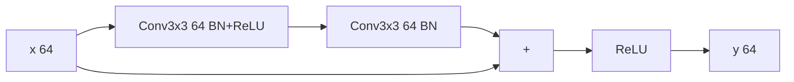

有降采样（同时通道数增加）：

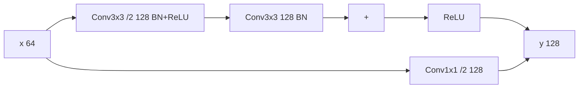

### 残差单元结构**BottleneckBlock**

引入该单元的目的是在更深的网络中降低卷积的计算量，减小时间复杂度，先通过一个卷积层降低通道数，然后再进行真正的卷积，最后再恢复原有通道数

> **Tensorflow**文档里提到第一层用的不是1x1卷积，而是3x3 /2的卷积，这个效果会略优于原文版本。做了这个改动之后的**ResNet**可称为**ResNetV1.5**，然而实际代码里没改

无降采样：

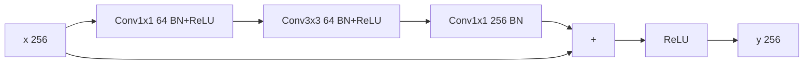

有降采样（同时通道数增加）：

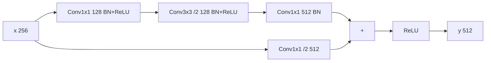

### **ResNetV1**网络结构

**ResNetV1**的主体结构就是两种残差单元的堆叠

|层|输出大小|ResNet18|ResNet34|ResNet50|ResNet101|ResNet152|
|:-:|:-:|:-:|:-:|:-:|:-:|:-:|
|Conv1|112x112|7x7 /2 64|7x7 /2 64|7x7 /2 64|7x7 /2 64|7x7 /2 64|
|MaxPool|56x56|3x3 /2|3x3 /2|3x3 /2|3x3 /2|3x3 /2|
|ResUnit1|56x56|[Block 64]x2|[Block 64]x3|[Bottleneck 256]x3|[Bottleneck 256]x3|[Bottleneck 256]x3|
|ResUnit2|28x28|[Block 128]x2|[Block 128]x4|[Bottleneck 512]x4|[Bottleneck 512]x4|[Bottleneck 512]x8|
|ResUnit3|14x14|[Block 256]x2|[Block 256]x6|[Bottleneck 1024]x6|[Bottleneck 1024]x23|[Bottleneck 1024]x36|
|ResUnit4|7x7|[Block 512]x2|[Block 512]x3|[Bottleneck 2048]x3|[Bottleneck 2048]x3|[Bottleneck 2048]x3|
|MaxPool|1x1|7x7 /7|7x7 /7|7x7 /7|7x7 /7|7x7 /7|
|FC|1000|-|-|-|-|-|

### 相关实验

1. 直接通路为了和残差层形状一致需要额外的线性映射：A)直接在扩展的通道上补0。B)仅在需要同步形状的地方使用1x1的卷积。C)所有通路都使用1x1卷积。实际采用B)，因为A)的用途主要用于和普通网络进行比较（因为没有引入新参数），而C)的提升不明显而且会带来较多开销。因而不需要形状变换的地方均直接连接，需要变换的地方使用1x1的卷积维持形状一致
2. 瓶颈块**BottleneckBlock**。目的是用较小的计算开销达到较深的层数，用于更深的网络，将**ResNet34**中的所有**Block**换成**BottleneckBlock**后即变为**ResNet50**，计算开销仅增加了5.56%。而且在**BottleneckBlock**下，直接通路更需要采用方案B)，因为输出通道数较多，额外一个卷积使计算量翻倍后的增量也更大。

## **ResNetV2**

[文章链接](https://arxiv.org/pdf/1603.05027.pdf)

这篇文章的主要目的是分析直接通路在**ResNet**中的作用，从而优化网络结构。其认为只要将每个**Block**的最后的激活函数也改成直接通路，那么任何一个单元的信号都可以直接通到任意其它单元里，这可以降低训练的难度。在堆叠残差网络中，每一个残差单元可以表示为：

$$
x_l=\sigma(h(x_{l-1})+F(x_{l-1},W_{l-1}))
$$

其中$$x_l$$代表当前层的输出以及下一层的输入，$$\sigma$$代表激活函数，$$x_{l-1}$$表示当前层的输入，$$F$$表示残差单元且$$W_{l-1}$$为其参数。$$h(x)=x$$表示直接通路，$$h(x)=Conv(x, w)$$表示需要同步形状大小。

如果令$$\sigma(x)=x$$，且$$h(x)=x$$，则残差单元可以改写为：

$$
x_l=x_{l-1}+F(x_{l-1},W_{l-1})
$$

那么任意一个较深的输入层$$L$$，可以用任意较浅的输入层$$l$$来表示：

$$
x_L=x_l+\sum_{i=l}^{L-1}{F(x_i,W_i)}
$$

这使得：

1. 任意两个节点之间仅存在一种“残差”关系
2. 从第一层的输入到最后一层的输出，所有单元的结果是相加的；而普通网络每一层的结果是相乘的（忽略BN和ReLU）
3. 反向传播更有优势。定义损失函数$$\epsilon$$，梯度$$\frac{\partial\epsilon}{\partial x_l}=\frac{\partial\epsilon}{\partial x_L}(1+\frac{\partial}{\partial x_l}\sum_{i=l}^{L-1}{F(x_i,W_i)})$$。可以看到梯度分为了两项，括号内加号左侧表示直接传播项，而右侧表示经过隐藏层的反向传播。深层网络存在一条通路直接将信息传递给浅层网络
4. 梯度不易消失，因为一般情况下求和项的结果在一个batch里不可能全为$$-1$$（原话，没写原因）

### $$h(x)$$对结果的影响

而以下几组实验表明，在$$h(x)=x$$的基础上对其作的改动都会使得最终结果变差（基准$$error=6.61$$），因而保证数据的直接传递有其必要性：

|常数缩放|$$y=(1-\lambda)x+\lambda F(x,w)$$|$$error=12.35$$||
|独占门控|$$y=(1-g(x))x+g(x)F(x,w)$$，$$g(x)=sigmoid(Wx+b)$$|$$error=8.70$$|和$$b$$的初值显著相关|
|仅近路门控|$$y=(1-g(x))x+F(x,w)$$，$$g(x)=sigmoid(Wx+b)$$|$$error=6.91$$|和$$b$$的初值显著相关|
|卷积|$$y=Conv(x)+F(x,w)$$|$$error=12.22$$||
|随机丢弃|$$y=Dropout(x,0.5)+F(x,w)$$|$$error\gt 20$$||

### $$\sigma(x)$$对结果的影响

因为原网络的激活函数是在两条通路相加之后，即$$\sigma(x)=ReLU(x)$$，为了实现$$\sigma(x)=x$$，需要做的是调换相应层的顺序。经过调换，一个残差单元可以具有以下变体：

1. 原始：
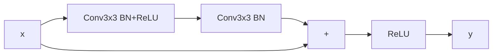
2. 加法后BN：
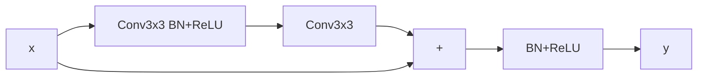
3. 加法前ReLU
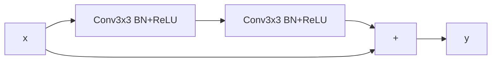
4. 仅ReLU预激活：
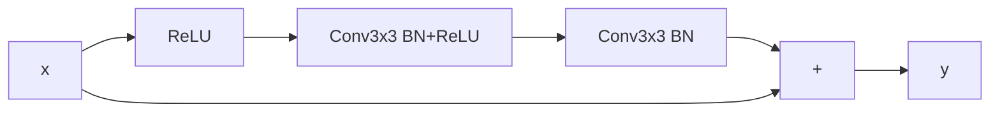
5. 完全预激活：
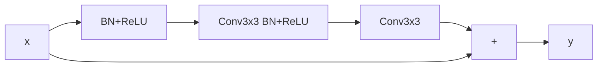

分析：

- 加法后BN。显然BN层阻断了数据的直接传输，在**CIFAR-10**数据集上训练误差会更大
- 加法前ReLU。虽然数据直接传输得到了保证，但是ReLU将残差的值限定在了$$[0,+\inf)$$，而希望的残差值应该在$$(-\inf,+\inf)$$之间，所以训练误差也会增大
- 预激活。传统的残差单元在加法后进行激活，相当于同时对下一层的两条通路都进行了激活。现在将这个对称的激活机制改成非对称的（仅对残差通路激活），同时将该激活算到下一个单元内，就可以得到4.的结构。如果进一步把分支内的最后一个BN也挪到下一个分支的第一个卷积层前，就可以得到5.的结构。分支内第一个卷积之前的BN+ReLU或ReLU即预激活
    - 如果仅用4.的结构，那么分支的预激活层的激活函数前完全不存在BN，享受不到BN带来的好处，所以实测和原始**ResNetV1**相差不大，反而误差略大
    - 如果使用5.的结构，实际结果会有比较明显的提升。其提到的原因有两个：直接通路降低训练难度；而激活前的BN提高了模型的正规性

### ResBlockV2

根据上述结论，原文改进了残差单元的结构，即采用完全预激活的方式

无降采样：

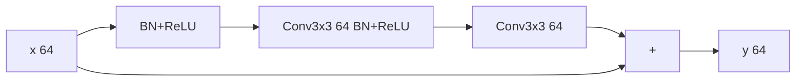

有降采样（同时通道数增加）：

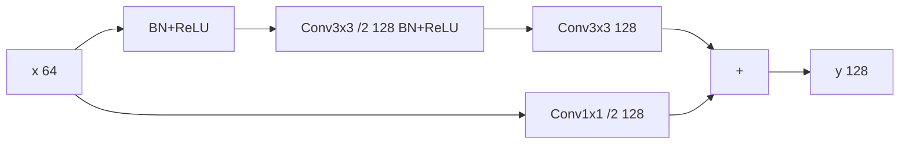

### BottleneckV2

同时对应的瓶颈块也作相应修改

无降采样：

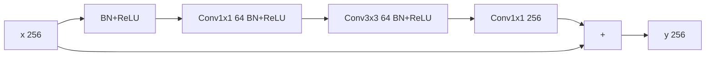

有降采样（同时通道数增加）：

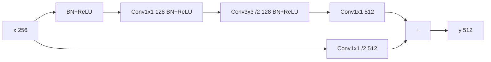

### 对比**V1**

1. 原始模型中ReLU的存在阻碍了数据在浅层和深层之间的直接传播，因为所有小于0的部分都被截断，训练初期误差会更难下降，网络越深，ReLU越多，传播越困难，而**V2**模型大大降低了阻碍，使得初期会更快收敛
2. 原始模型中由于每一层的输入由上一层的直接通路和残差两部分相加组成，虽然残差部分经过了归一化，但是直接通路没有，因而当前层的输入数据是未经过归一化的，将这些数据直接送入当前层的残差分支相当于未进行BN可能会存在过拟合。而**V2**的预激活保证残差分支的数据都是归一化之后的，可以减少过拟合的现象

## **MobileNetV1**

**MobileNet**的目的是缩减网络大小，降低正向用时，从而适用于移动端

### 分离卷积

分离卷积是用来降低卷积的运算量的。假设输入特征图的形状为$$H\times W\times C_1$$，输出的特征图的形状为$$H\times W\times C_2$$，传统的卷积核大小为$$k\times k\times C_1\times C_2$$个参数，并且需要$$k\times k\times C_1\times C_2\times H\times W$$次浮点运算。而分离卷积将卷积层分为两个部分：第一部分使用$$k\times k\times 1\times 1$$的卷积核对输入图像的每一通道独立卷积，然后将特征图按原顺序堆叠，这样的卷积即逐深度卷积；第二部分使用传统的$$1\times 1\times C_1\times C_2$$卷积核，改变通道数。一、二两个部分共同作用使得特征图的大小和传统卷积输出的大小相同。但是对于分离卷积，卷积核的参数数量合计为$$k\times k+C_1\times C_2$$，需要$$k\times k\times C_1\times H\times W+C_1\times C_2\times H\times W$$次浮点运算。分离卷积和传统卷积的计算量之比为：

$$
\frac{k\times k\times C_1\times H\times W+C_1\times C_2\times H\times W}{k\times k\times C_1\times C_2\times H\times W}=\frac{1}{k^2}+\frac{1}{C_2}
$$

如果采用$$3\times 3$$的卷积核，通道数在64以上，那么整个分离卷积的效率是传统卷积的7倍以上，但是精度的损失却是十分微小的。

### 分离卷积单元**DWBlock**

**MobileNet**采用的卷积单元并非直接连接两个卷积层，然后给输出层增加BN和ReLU，而是在每个卷积层之后都增加BN和ReLU

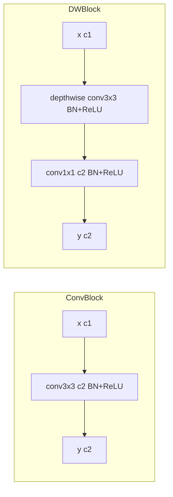

### **MobileNetV1**网络结构

|层|输出大小|结构|
|:-:|:-:|:-:|
|ConvBlock1|112x112|3x3 /2 32|
|DWBlock1|112x112|3x3 64|
|DWBlock2|56x56|3x3 /2 128|
|DWBlock3|56x56|3x3 128|
|DWBlock4|28x28|3x3 /2 256|
|DWBlock5|28x28|3x3 256|
|DWBlock6|14x14|3x3 /2 512|
|DWBlock7|14x14|[3x3 512]x5|
|DWBlock8|7x7|3x3 /2 1024|
|DWBlock9|7x7|3x3 1024|
|AvgPool|1x1|7x7 /7|
|FC|1000|-|

### 深度倍乘以及分辨率倍乘

为了更好地测试**MobileNetV1**在不同网络大小的效果，其提供了两个倍率：深度$$\alpha$$，以及分辨率$$\rho$$

1. 深度倍乘降整个网络的卷积通道数缩放为原来的$$\alpha$$倍，那么所需的计算量为：$$k\times k\times\alpha C_1\times H\times W+\alpha C_1\times\alpha C_2\times H\times W$$，在普通网络取$$k=3$$的情况下，$$k^2\ll C_2$$，整个网络的计算量大约缩放为原来的$$\alpha^2$$倍
2. 分辨率降输入图片给的分辨率为原来的$$\rho$$倍，那么同理所需计算量变为原来的$$\rho^2$$倍

通过调整上述两个倍率，可以轻易获得不同大小水平的网络，并且可以定量分析网络大小与精度的关系，从而找到耗时与精度的平衡点

## **MobileNetV2**

TODO
