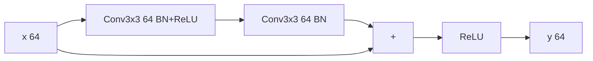
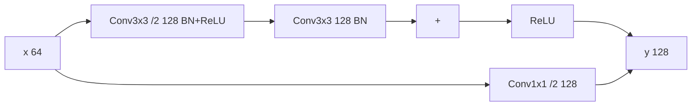
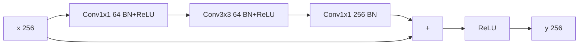
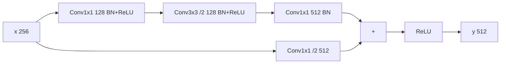

## ResNetV1

[文章链接](https://arxiv.org/pdf/1512.03385.pdf)

**ResNet**的出发点是因为传统分类网络下，不改变结构而单纯增加网络层数会使精度达到一个饱和状态，在此基础上继续增加层数，训练误差反而会增加，并且层数越多误差越大。

而事实上，我们总可以构造一个更深（$$p$$层）的网络，使得其训练误差不大于较浅（$$q$$层）的网络：前$$q$$层和浅网络完全一致，后$$p-q$$层每层都只是原样输出输入数据。所以深层网络必然存在一个精度和浅层网络相等的解，上述训练误差增加的现象显然存在问题。

传统网络的做法是靠非线性层的堆叠来优化得到近似的目标函数$$\hat{H}(x)=F_1(x)$$，**ResNet**的做法是优化残差，即$$\hat{H}(x)=F_2(x)+x$$，$$F_2(x)$$即预测函数的残差。根据之前的结果，深层网络必然有一个不劣于浅层网络的解。如果这个解已经是最优解，则$$H(x)=x$$，得到$$F_1(x)\rightarrow x$$以及$$F_2(x)\rightarrow 0$$。显然$$F_2(x)$$的优化要更容易进行。

为了优化残差，**ResNet**定义了残差块：$$y=\sigma(F(x)+Wx)$$，其中$$F(x)$$可以是任意已有的网络结构，除了最后无激活函数（加法后再激活，即$$\sigma$$）;$$W$$仅用于让输入和网络输出形状相同使其可以逐元素相加。

### 残差单元结构ResBlock

残差单元从输入分为两条路径，一条进入卷积网络，计算残差，另一条原样输出。两者相加后再进行激活

无降采样：

有降采样（同时通道数增加）：

### 残差单元结构Bottleneck

引入该单元的目的是在更深的网络中降低卷积的计算量，减小时间复杂度，先通过一个卷积层降低通道数，然后再进行真正的卷积，最后再恢复原有通道数

无降采样：

有降采样（有降采样的层通道数翻倍）：

### **ResNetV1**网络结构

**ResNetV1**的主体结构就是两种残差单元的堆叠

|层|输出大小|ResNet18|ResNet34|ResNet50|ResNet101|ResNet152|
|:-:|:-:|:-:|:-:|:-:|:-:|:-:|
|Conv1|112x112|7x7 /2 64|7x7 /2 64|7x7 /2 64|7x7 /2 64|7x7 /2 64|
|MaxPool|56x56|3x3 /2|3x3 /2|3x3 /2|3x3 /2|3x3 /2|
|ResUnit1|56x56|[Block 64]x2|[Block 64]x3|[Bottleneck 256]x3|[Bottleneck 256]x3|[Bottleneck 256]x3|
|ResUnit2|28x28|[Block 128]x2|[Block 128]x4|[Bottleneck 512]x4|[Bottleneck 512]x4|[Bottleneck 512]x8|
|ResUnit3|14x14|[Block 256]x2|[Block 256]x6|[Bottleneck 1024]x6|[Bottleneck 1024]x23|[Bottleneck 1024]x36|
|ResUnit4|7x7|[Block 512]x2|[Block 512]x3|[Bottleneck 2048]x3|[Bottleneck 2048]x3|[Bottleneck 2048]x3|
|MaxPool|1x1|7x7 /7|7x7 /7|7x7 /7|7x7 /7|7x7 /7|
|FC|1000|-|-|-|-|-|

### 相关实验

1. 直接通路为了和残差层形状一致需要额外的线性映射：A)直接在扩展的通道上补0。B)仅在需要同步形状的地方使用1x1的卷积。C)所有通路都使用1x1卷积。实际采用B)，因为A)的用途主要用于和普通网络进行比较（因为没有引入新参数），而C)的提升不明显而且会带来较多开销。因而不需要形状变换的地方均直接连接，需要变换的地方使用1x1的卷积维持形状一致
2. 瓶颈块Bottleneck。目的是用较小的计算开销达到较深的层数，用于更深的网络，将**ResNet34**中的所有Block换成BottleneckBlock后即变为**ResNet50**，计算开销仅增加了5.56%。而且在BottleneckBlock下，直接通路更需要采用方案B)，因为输出通道数较多，额外一个卷积使计算量翻倍后的增量也更大。

## ResNetV2

[文章链接](https://arxiv.org/pdf/1603.05027.pdf)

这篇文章的主要目的是分析直接通路在**ResNet**中的作用，从而优化网络结构。其认为只要将**V1**中每个ResBlock最后的激活函数也改成直接通路，那么任何一个单元的信号都可以直接通到任意其它单元里，这可以降低训练的难度。在堆叠残差网络中，每一个残差单元可以表示为：

$$
x_l=\sigma(h(x_{l-1})+F(x_{l-1},W_{l-1}))
$$

其中$$x_l$$代表当前层的输出以及下一层的输入，$$\sigma$$代表激活函数，$$x_{l-1}$$表示当前层的输入，$$F$$表示残差单元且$$W_{l-1}$$为其参数。$$h(x)=x$$表示直接通路，$$h(x)=Conv(x, w)$$表示需要同步形状大小，为方便讨论统一$$h(x)=x$$。

