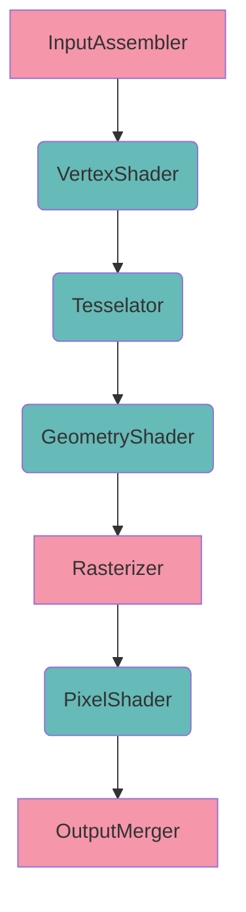

- [1. 实例](#1-%e5%ae%9e%e4%be%8b)
  - [1.1. 实例层 & 实例扩展](#11-%e5%ae%9e%e4%be%8b%e5%b1%82--%e5%ae%9e%e4%be%8b%e6%89%a9%e5%b1%95)
  - [1.2. VkInstance](#12-vkinstance)
  - [1.3. VkDebugUtilsMessengerEXT](#13-vkdebugutilsmessengerext)
- [2. 窗口](#2-%e7%aa%97%e5%8f%a3)
- [3. 设备](#3-%e8%ae%be%e5%a4%87)
  - [3.1. 物理设备](#31-%e7%89%a9%e7%90%86%e8%ae%be%e5%a4%87)
    - [3.1.1. VkPhysicalDevice](#311-vkphysicaldevice)
    - [3.1.2. 设备属性 & 设备特性](#312-%e8%ae%be%e5%a4%87%e5%b1%9e%e6%80%a7--%e8%ae%be%e5%a4%87%e7%89%b9%e6%80%a7)
    - [3.1.3. 设备层 & 设备扩展](#313-%e8%ae%be%e5%a4%87%e5%b1%82--%e8%ae%be%e5%a4%87%e6%89%a9%e5%b1%95)
    - [3.1.4. 与窗口的兼容性](#314-%e4%b8%8e%e7%aa%97%e5%8f%a3%e7%9a%84%e5%85%bc%e5%ae%b9%e6%80%a7)
    - [3.1.5. 队列族](#315-%e9%98%9f%e5%88%97%e6%97%8f)
  - [3.2. 逻辑设备](#32-%e9%80%bb%e8%be%91%e8%ae%be%e5%a4%87)
    - [3.2.1. VkDevice](#321-vkdevice)
  - [3.3. 指令池](#33-%e6%8c%87%e4%bb%a4%e6%b1%a0)
- [4. 交换链](#4-%e4%ba%a4%e6%8d%a2%e9%93%be)
  - [4.1. VkSwapchainKHR](#41-vkswapchainkhr)
  - [4.2. VkImage](#42-vkimage)
  - [4.2. VkImageView](#42-vkimageview)
- [5. 流水线](#5-%e6%b5%81%e6%b0%b4%e7%ba%bf)
  - [5.1. 着色器](#51-%e7%9d%80%e8%89%b2%e5%99%a8)
    - [5.1.1. VkShaderModule](#511-vkshadermodule)
    - [5.1.2. VkPipelineShaderStageCreateInfo](#512-vkpipelineshaderstagecreateinfo)
  - [5.2. 固定状态](#52-%e5%9b%ba%e5%ae%9a%e7%8a%b6%e6%80%81)
    - [5.2.1. VkPipelineVertexInputStateCreateInfo](#521-vkpipelinevertexinputstatecreateinfo)
    - [5.2.2. VkPipelineInputAssemblyStateCreateInfo](#522-vkpipelineinputassemblystatecreateinfo)
    - [5.2.3. VkPipelineTessellationStateCreateInfo](#523-vkpipelinetessellationstatecreateinfo)
    - [5.2.4. VkPipelineViewportStateCreateInfo](#524-vkpipelineviewportstatecreateinfo)
    - [5.2.5. VkPipelineRasterizationStateCreateInfo](#525-vkpipelinerasterizationstatecreateinfo)
    - [5.2.6. VkPipelineMultisampleStateCreateInfo](#526-vkpipelinemultisamplestatecreateinfo)
    - [5.2.7. VkPipelineDepthStencilStateCreateInfo](#527-vkpipelinedepthstencilstatecreateinfo)
    - [5.2.8. VkPipelineColorBlendStateCreateInfo](#528-vkpipelinecolorblendstatecreateinfo)
    - [5.2.9. VkPipelineDynamicStateCreateInfo](#529-vkpipelinedynamicstatecreateinfo)
  - [5.3. 流水线布局](#53-%e6%b5%81%e6%b0%b4%e7%ba%bf%e5%b8%83%e5%b1%80)
    - [5.3.1. 描述集布局](#531-%e6%8f%8f%e8%bf%b0%e9%9b%86%e5%b8%83%e5%b1%80)
    - [5.3.2. Push Constant Range](#532-push-constant-range)
  - [5.4. 渲染流程](#54-%e6%b8%b2%e6%9f%93%e6%b5%81%e7%a8%8b)
    - [5.4.1. VkAttachmentDescription](#541-vkattachmentdescription)
    - [5.4.2. VkSubpassDescription](#542-vksubpassdescription)
    - [5.4.3. VkSubpassDependency](#543-vksubpassdependency)
  - [5.5. 管线](#55-%e7%ae%a1%e7%ba%bf)
- [6. 缓存](#6-%e7%bc%93%e5%ad%98)
  - [6.1. VkSemaphore](#61-vksemaphore)
  - [6.2. VkFence](#62-vkfence)
  - [6.3. VkFramebuffer](#63-vkframebuffer)
  - [6.4. VkCommandBuffer](#64-vkcommandbuffer)
  - [6.5. VkBuffer & VkDeviceMemory](#65-vkbuffer--vkdevicememory)
  - [6.6. VkDescriptorPool & VkDescriptorSet](#66-vkdescriptorpool--vkdescriptorset)
    - [6.6.1. VkDescriptorSet](#661-vkdescriptorset)
    - [6.6.2. VkDescriptorPool](#662-vkdescriptorpool)
- [7. 渲染循环](#7-%e6%b8%b2%e6%9f%93%e5%be%aa%e7%8e%af)
  - [7.1. 宿主-设备同步](#71-%e5%ae%bf%e4%b8%bb-%e8%ae%be%e5%a4%87%e5%90%8c%e6%ad%a5)
  - [7.2. 获取图像](#72-%e8%8e%b7%e5%8f%96%e5%9b%be%e5%83%8f)
  - [7.3. 提交指令](#73-%e6%8f%90%e4%ba%a4%e6%8c%87%e4%bb%a4)
  - [7.4. 显示](#74-%e6%98%be%e7%a4%ba)
  - [7.5. 设备-设备同步](#75-%e8%ae%be%e5%a4%87-%e8%ae%be%e5%a4%87%e5%90%8c%e6%ad%a5)

## 1. 实例

### 1.1. 实例层 & 实例扩展

{:.tbl style="background-color:#EEC"}
|接口|功能|
|-|-|
| vkEnumerateInstanceLayerProperties() | 枚举所有VulkanRT支持的层 |
| vkEnumerateInstanceExtensionProperties() | 枚举所有VulkanRT支持的扩展 |

### 1.2. VkInstance

句柄`VkInstance`，对应结构体`VkInstanceCreateInfo`。VulkanRT库初始化。

结构体内要提供**开启的实例层**{:.text-error}、**开启的实例扩展**{:.text-error}以及**结构体VkApplicationInfo**{:.text-error}。实例层以及实例扩展需要VulkanRT支持，结构体不包含重要信息。

> Vulkan的合法性检查需要开启`"VK_LAYER_LUNARG_standard_validation"`层\\
> GLFW窗口需要开启`glfwGetRequiredInstanceExtensions()`获得的扩展\\
> 启用调试需要开启`"VK_EXT_debug_utils"`扩展

### 1.3. VkDebugUtilsMessengerEXT

句柄`VkDebugUtilsMessengerEXT`，对应结构体`VkDebugUtilsMessengerCreateInfoEXT`。开启调试回调。

> 该句柄的创建和销毁接口需要运行期通过接口`vkGetInstanceProcAddr()`获得

结构体内要提供**回调函数**{:.text-error}。启用`"VK_EXT_debug_utils"`扩展后Debug消息会调用回调函数，启用`"VK_LAYER_LUNARG_standard_validation"`层后Vulkan合法性检查相关内容也会以Debug消息的形式进行反馈。

## 2. 窗口

句柄`GLFWwindow*`，为GLFW库内容，需要开启相应的实例层。

句柄`VkSurfaceKHR`，无对应结构体，由GLFW库实现创建（依赖`GLFWwindow*`以及`VkInstance`）。

## 3. 设备

### 3.1. 物理设备

#### 3.1.1. VkPhysicalDevice

句柄`VkPhysicalDevice`，无对应结构体，由`VkInstance`枚举而得。表示可用的GPU。

#### 3.1.2. 设备属性 & 设备特性

{:.tbl style="background-color:#EEC"}
|接口|功能|
|-|-|
| vkGetPhysicalDeviceProperties() | 获得所有物理设备的属性 |
| vkGetPhysicalDeviceFeatures() | 获得所有物理设备的特性 |

#### 3.1.3. 设备层 & 设备扩展

{:.tbl style="background-color:#EEC"}
|接口|功能|
|-|-|
| vkEnumerateDeviceLayerProperties() | 枚举所有物理设备支持的层 |
| vkEnumerateDeviceExtensionProperties() | 枚举所有物理设备支持的扩展 |

#### 3.1.4. 与窗口的兼容性

{:.tbl style="background-color:#EEC"}
|接口|功能|
|-|-|
| vkGetPhysicalDeviceSurfaceFormatsKHR() | 获得所有Surface支持的数据格式 |
| vkGetPhysicalDeviceSurfacePresentModesKHR() | 获得所有Surface支持的显示模式 |

#### 3.1.5. 队列族

队列族代表一系列Vulkan指令的集合。

{:.tbl style="background-color:#EEC"}
|接口|功能|
|-|-|
| vkGetPhysicalDeviceQueueFamilyProperties() | 获得物理设备的所有队列族 |

运行时任意设备获得的队列族信息是固定的，因此在需要使用队列族的地方往往用**索引**{:.text-error}来访问。

### 3.2. 逻辑设备

#### 3.2.1. VkDevice

句柄`VkDevice`，对应结构体`VkDeviceCreateInfo`。与Vulkan API交互的虚拟设备。

结构体内要提供**开启的设备层**{:.text-error}、**开启的设备扩展**{:.text-error}、**开启的设备特性**{:.text-error}以及**结构体VkDeviceQueueCreateInfo列表**{:.text-error}。设备层、设备扩展以及设备特性需要物理设备支持，结构体列表用于从队列族创建队列。

每个结构体`VkDeviceQueueCreateInfo`内要提供**队列族的索引**{:.text-error}以及**该队列族创建的队列数量**{:.text-error}。

> 如果创建成功`vkGetDeviceQueue()`接口可以获得队列的句柄

### 3.3. 指令池

句柄`VkCommandPool`，对应结构体`VkCommandPoolCreateInfo`。每个队列族需要一个指令池用以分配指令缓存。

结构体内要提供**队列族**{:.text-error}。

## 4. 交换链

### 4.1. VkSwapchainKHR

句柄`VkSwapchainKHR`，对应结构体`VkSwapchainCreateInfoKHR`。用于Vulkan图像和Surface交互。其管理了一个图像队列，并按一定规则将图像送至Surface用于显示。

结构体内要提供**Surface**{:.text-error}、**图像属性**{:.text-error}、**显示模式**{:.text-error}等内容。

图像属性包括：

{:.tbl style="background-color:#EEC"}
|属性|意义|
|-|-|
| minImageCount | 图像队列大小（需要在物理设备和Surface允许的范围内） |
| imageFormat | 图像每个像素的格式（需要物理设备和Surface支持） |
| imageColorSpace | 图像的颜色空间（需要物理设备和Surface支持） |
| imageExtent | 图像大小（与Surface管理的窗口大小相同） |
| imageArrayLayers | 图像层数，表示3D图像，取1则表示2D图像 |
| imageUsage | 图像用途（颜色缓存，深度缓存。。。） |
| imageSharingMode | 描述不同队列族的指令如何访问同一图像 |

显示模式（需要物理设备和Surface支持）包括：

{:.tbl style="background-color:#EEC"}
|属性|意义|
|-|-|
| VK_PRESENT_MODE_IMMEDIATE_KHR | 图像与Surface同步 |
| VK_PRESENT_MODE_MAILBOX_KHR | 图像与Surface通过图像队列异步；如果队列已满，之的提交会被覆盖 |
| VK_PRESENT_MODE_FIFO_KHR | 图像与Surface通过图像队列异步；如果队列已满，图像会等待Surface |
| VK_PRESENT_MODE_FIFO_RELAXED_KHR | 同上，但是如果队列为空，下一次提交会直接与Surface同步 |

### 4.2. VkImage

句柄`VkImage`，对应结构体`VkImageCreateInfo`（若由`VkSwapchainKHR`管理，则不通过该结构体创建）。用于描述Vulkan中的所有图像。

接口`vkGetSwapchainImagesKHR()`可直接获得图像队列中每张图像的句柄。

### 4.2. VkImageView

句柄`VkImageView`，对应结构体`VkImageViewCreateInfo`。`VkImage`中的内容不能直接访问，需要通过相应的`VkImageView`才能进行读写。

`VkImageView`有自己的**像素格式**{:.text-error}，需要与对应`VkImage`的格式兼容。类似DX11中`ID3D11ShaderResourceView`的格式需要与对应的`ID3D11Texture2D`格式兼容。

`VkImageView`可进行**通道映射**{:.text-error}，其每个通道都可以指定`VkImage`的任意一个通道。

`VkImageView`可只访问`VkImage`的一部分。包括部分连续的MipMap，部分连续层。

## 5. 流水线

句柄`VkPipeline`，对应结构体`VkGraphicsPipelineCreateInfo`或`VkComputePipelineCreateInfo`。描述流水线构成，可以是图形管线，也可以是计算管线。

描述图形管线的`VkPipeline`包括以下部分：

{:.tbl style="background-color:#EEC"}
|流水线组成|意义|
|-|-|
| 着色器（Shader Stage） | 可编程着色器 |
| 固定状态（Fixed State） | 不可编程但可配置的内容 |
| 流水线布局（Pipeline Layout） | 用于着色器访问外部数据 |
| 渲染流程（Render Pass） | 控制流水线的运行时行为 |

### 5.1. 着色器

Vulkan使用`SPIR-V`字节码作为SL。可以由HLSL、GLSL等直接编译而来。

#### 5.1.1. VkShaderModule

句柄`VkShaderModule`，对应结构体`VkShaderModuleCreateInfo`。作为`SPIR-V`字节码的容器。

#### 5.1.2. VkPipelineShaderStageCreateInfo

结构体`VkPipelineShaderStageCreateInfo`列表，描述`VkPipeline`中每个着色器阶段的`VkShaderModule`绑定信息。

### 5.2. 固定状态

#### 5.2.1. VkPipelineVertexInputStateCreateInfo

结构体`VkPipelineShaderStageCreateInfo`，描述：

{:.tbl style="background-color:#EEC"}
| 顶点结构体描述列表 | std::vector&lt;VkVertexInputBindingDescription&gt; |
| 顶点属性描述列表 | std::vector&lt;VkVertexInputAttributeDescription&gt; |

流水线通过绑定槽（Bind）读取顶点数据，每个Bind用一个`VkVertexInputBindingDescription`描述，包括槽位号、每个顶点所占的空间以及该槽是逐顶点数据还是逐实例数据。

着色器通过`layout(location=xxx)`访问顶点数据，每个layout用一个`VkVertexInputAttributeDescription`描述，包括着色器内的位置location、顶点所处的Bind、访问格式以及数据所在顶点结构体的偏移值。

#### 5.2.2. VkPipelineInputAssemblyStateCreateInfo

结构体`VkPipelineInputAssemblyStateCreateInfo`，描述光栅化时如何利用顶点组成图元。

#### 5.2.3. VkPipelineTessellationStateCreateInfo

TODO

#### 5.2.4. VkPipelineViewportStateCreateInfo

结构体`VkPipelineViewportStateCreateInfo`，描述视口以及剪刀。

{:.tbl style="background-color:#EEC"}
| 视口列表 | std::vector&lt;VkViewport&gt; |
| 剪刀列表 | std::vector&lt;VkRect2D&gt; |

视口描述如何从NDC映射到Frame Buffer，而剪刀描述了Frame Buffer的可见区域。

#### 5.2.5. VkPipelineRasterizationStateCreateInfo

结构体`VkPipelineRasterizationStateCreateInfo`，描述光栅化的配置：

{:.tbl style="background-color:#EEC"}
| depthClampEnable | 开启后，深度在远近平面以外会被截断 |
| rasterizerDiscardEnable | 开启后，流水线到此为止 |
| polygonMode | 多边形填充方案 |
| cullMode | 剔除方案 |
| frontFace | 正面规则 |

#### 5.2.6. VkPipelineMultisampleStateCreateInfo

TODO

#### 5.2.7. VkPipelineDepthStencilStateCreateInfo

TODO

#### 5.2.8. VkPipelineColorBlendStateCreateInfo

TODO

#### 5.2.9. VkPipelineDynamicStateCreateInfo

TODO

### 5.3. 流水线布局

句柄`VkPipelineLayout`，对应结构体`VkPipelineLayoutCreateInfo`，描述着色器资源（Shader Resource）的布局

结构体内要提供**描述集布局（Descriptor Set Layout）列表**{:.text-error}以及**Push Constant Range列表**{:.text-error}。每个描述集布局代表了一种着色器资源组织形式。

#### 5.3.1. 描述集布局

句柄`VkDescriptorSetLayout`，对应结构体`VkDescriptorSetLayoutCreateInfo`。

着色器通过`layout(binding=XXX)`访问着色器资源，每个layout用一个`VkDescriptorSetLayoutBinding`描述，包括着色器内的位置binding、资源类型以及能被那几个着色器阶段访问。此外，如果资源是一个列表，还需要提供列表长度。

#### 5.3.2. Push Constant Range

TODO

### 5.4. 渲染流程

句柄`VkRenderPass`，对应结构体`VkRenderPassCreateInfo`。包括：

{:.tbl style="background-color:#EEC"}
| 图像附件描述列表 | std::vector&lt;VkAttachmentDescription&gt; |
| 子流程描述列表 | std::vector&lt;VkSubpassDescription&gt; |
| 子流程依赖列表 | std::vector&lt;VkSubpassDependency&gt; |

#### 5.4.1. VkAttachmentDescription

结构体`VkAttachmentDescription`，描述渲染流程中用到的图像属性：

{:.tbl style="background-color:#EEC"}
| format | 图像每个像素的格式 |
| samples | 采样数量 |
| loadOp/storeOp | 读写时的操作 |
| stencilLoadOp/stencilStoreOp | 模板读写时的操作 |
| initialLayout/finalLayout | 图像进入/完成流程时的布局 |

#### 5.4.2. VkSubpassDescription

结构体`VkSubpassDescription`，描述渲染流程中的每一个子流程所使用的图像：

{:.tbl style="background-color:#EEC"}
| InputAttachment[] | 用于着色器读入 |
| ColorAttachment[] | 用于着色器输出 |
| ResolveAttachment | 用于多采样 |
| DepthStencilAttachment | 用于深度/模板 |
| PreserveAttachment[] | 子流程不会修改这些图像里的数据 |

#### 5.4.3. VkSubpassDependency

结构体`VkSubpassDependency`，描述子流程之间的依赖关系（资源内存依赖），后一子流程中指定阶段的指定访问需要等待前一子流程中指定阶段的指定访问全部完成：

{:.tbl style="background-color:#EEC"}
| srcSubpass/dstSubpass | 前后相关的子流程 |
| srcStageMask/srcAccessMask | 需要等待的资源所在的流水线阶段以及访问操作类型 |
| dstStageMask/dstAccessMask | 需要被等待的资源所在的流水线阶段以及访问操作类型 |

### 5.5. 管线

{:.tbl style="background-color:#EEC"}
|管线阶段|对应VkPipeline部分|
|-|-|
| InputAssembler | 5.2.1.解析顶点 |
| XXXShader | 5.1.着色器，5.2.1.顶点绑定，5.3.着色器资源绑定 |
| Rasterizer | 5.2.2.图元解析，5.2.4.视口绑定，5.2.5.光栅化 |
| OutputMerger | 5.2.7.深度，5.2.8.混合，5.4.FrameBuffer绑定 |

## 6. 缓存

### 6.1. VkSemaphore

句柄`VkSemaphore`，对应结构体`VkSemaphoreCreateInfo`。实现GPU-GPU同步（先获得图像句柄才能渲染，渲染完才能显示）。

### 6.2. VkFence

句柄`VkFence`，对应结构体`VkFenceCreateInfo`。实现CPU-GPU同步（当GPU忙碌时，禁止CPU提交指令，防止指令无限提交导致内存泄漏）。

> `VkFence`创建时需要默认设置为触发状态，否则CPU会无限等待。

### 6.3. VkFramebuffer

句柄`VkFramebuffer`，对应结构体`VkFramebufferCreateInfo`。关联渲染流程中定义的**图像附件描述列表**{:.text-error}以及交换链中的**VkImageView**{:.text-error}。

传入的**VkImageView**{:.text-error}为一个列表，其顺序与**图像附件描述列表**{:.text-error}一一对应，因此流水线可以正确访问所有图像数据。

### 6.4. VkCommandBuffer

句柄`VkCommandBuffer`，对应结构体`VkCommandBufferAllocateInfo`。表示需要提交到队列的指令序列。

结构体内需要提供**指令池**{:.text-error}。任何指令缓存都需要通过指令池来分配空间。

Vulkan指令为形如`vkCmdXXX()`的接口，使用时在以下两个接口之间任意调用Vulkan指令，完成指令记录：

{:.tbl style="background-color:#EEC"}
| vkBeginCommandBuffer() |
| vkEndCommandBuffer() |

提交到队列后会按照记录的顺序逐一执行指令，由于指令是预先录制的，因此尽管只修改一条指令也需要重新录制。

### 6.5. VkBuffer & VkDeviceMemory

句柄`VkBuffer`，对应结构体`VkBufferCreateInfo`。可以表示任意的Vulkan缓存。

结构体内要提供**缓存实际字节数**{:.text-error}、**缓存用途**{:.text-error}以及**在不同队列族之间的共享模式**{:.text-error}。

{:.tbl style="background-color:#EEC"}
| 缓存实际字节数 | 数据所占的实际大小 |
| 缓存用途 | VK_BUFFER_USAGE_XXX，用于传输、或顶点、或索引、或着色器资源 |
| 共享模式 | 能否被属于不同队列族的指令共享 |

句柄`VkDeviceMemory`，对应结构体`VkMemoryAllocateInfo`。描述缓存在GPU上的显存，因为缓存本身不带任何存储空间，因此需要与`VkDeviceMemory`绑定。

结构体要提供**存储分配字节数**{:.text-error}以及**存储类型索引**{:.text-error}。

{:.tbl style="background-color:#EEC"}
| 存储分配字节数 | 在GPU上，考虑对齐问题后为缓存分配的空间大小 |
| 存储类型索引 | 物理设备提供了可用的存储类型，通过索引指定要使用的类型 |

接口`vkGetPhysicalDeviceMemoryProperties`可以获得物理设备支持的存储类型。由于存储类型是一个固定的列表，因此**存储类型索引**{:.text-error}代表的是存储类型在该列表中的索引。

接口`vkGetBufferMemoryRequirements()`可以获得缓存支持的存储类型以及**存储分配字节数**{:.text-error}。存储类型以位掩码的形式给出，`(1 << i) & type_bit == 1`等价于缓存支持`type[i]`对应的存储类型。

除了存储类型需要缓存支持外，还需要存储属性支持缓存的访问形式。每种存储类型都有对应的属性，以位掩码的形式给出，每种属性对应了一个`VK_MEMORY_PROPERTY_XXX`枚举。

> 例：\\
> 如果是GPU专有存储需要`VK_MEMORY_PROPERTY_DEVICE_LOCAL_BIT`属性\\
> 如果需要能够被CPU访问则需要`VK_MEMORY_PROPERTY_HOST_VISIBLE_BIT`属性与`VK_MEMORY_PROPERTY_HOST_COHERENT_BIT`属性。

接口`vkBindBufferMemory()`可以将缓存与存储绑定。

### 6.6. VkDescriptorPool & VkDescriptorSet

#### 6.6.1. VkDescriptorSet

句柄`VkDescriptorSet`，对应结构体`VkDescriptorSetAllocateInfo`。用于关联流水线布局中定义的**描述集布局**{:.text-error}以及对应的**VkBuffer**{:.text-error}。

每个`VkDescriptorSet`对应了一个`VkDescriptorSetLayout`，表示着色器会通过后者的布局来解析前者提供的数据。

而为了向`VkDescriptorSet`提供数据，需要通过结构体`VkWriteDescriptorSet`与接口`vkUpdateDescriptorSets()`来将`VkBuffer`内的数据打包：

{:.tbl style="background-color:#EEC"}
| dstSet | 目标VkDescriptorSet |
| dstBinding | 缓存对应的着色器位置 |
| dstArrayElement/descriptorCount | 如果缓存是个列表，则指定首元素以及元素数量 |
| descriptorType | 缓存类型（与VkBuffer中的缓存用途对应） |
| pXXXInfo | 数据种类Image/Buffer/TexelBuffer |

#### 6.6.2. VkDescriptorPool

句柄`VkDescriptorPool`，对应结构体`VkDescriptorPoolCreateInfo`。用于分配`VkDescriptorSet`。

结构体需要提供如下内容：

{:.tbl style="background-color:#EEC"}
| 最多分配的VkDescriptorSet数量 | uint32_t |
| 每种Descriptor的可分配数量 | std::vector&lt;VkDescriptorPoolSize&gt; |

前者规定了`VkDescriptorSet`（对应`VkDescriptorSetLayout`）的数量上限；后者规定了每一种Descriptor（对应`VkDescriptorSetLayout`中binding）的数量上限。

`VkDescriptorSet`不能直接创建，必须通过对应的池来进行分配。

## 7. 渲染循环

### 7.1. 宿主-设备同步

通过`VkFence`来实现，接口`vkWaitForFences()`可以让当前线程等待，直到相应的`VkFence`被触发。当`VkCommandBuffer`中的指令执行完成时，会触发`VkFence`。因此，CPU线程会与GPU上的渲染流程同步，防止CPU提交过量指令来不及处理导致内存泄漏。

### 7.2. 获取图像

`VkSwapchainKHR`中的图像除了被流水线使用之外，还要被用于显示。因此为了正确地让流水线往图像上渲染，需要使用空闲的图像。接口`vkAcquireNextImageKHR()`可以取到下一张空闲图像的索引。

### 7.3. 提交指令

接口`vkQueueSubmit()`，对应结构体`VkSubmitInfo`。用于将`VkCommandBuffer`提交到对应的图形队列，供GPU执行。

### 7.4. 显示

接口`vkQueuePresentKHR()`，对应结构体`VkPresentInfoKHR`。用于将渲染完成的图像提交到窗口上显示。

### 7.5. 设备-设备同步

**获取图像**{:.text-error}、**提交指令**{:.text-error}以及**显示**{:.text-error}必须按照顺序执行，为此，用`VkSemaphore`来进行同步。
